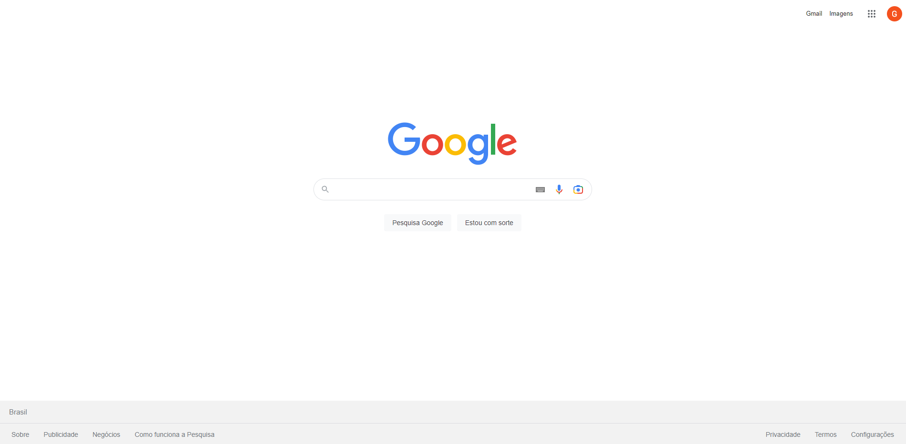
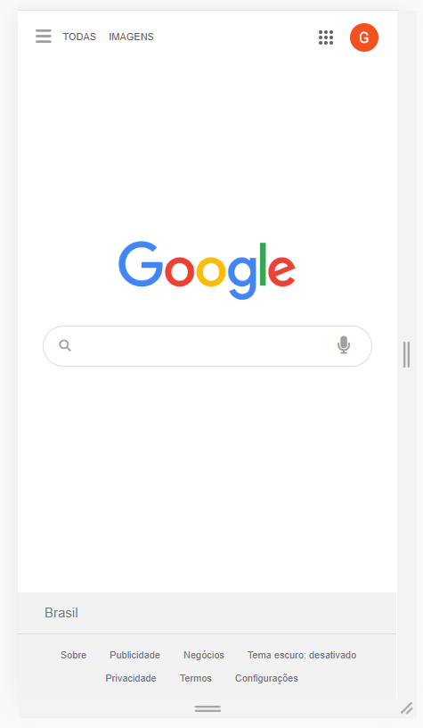

<h1 align="center">Projeto: Reconstrução do Google</h1>

 

<kbd>

 

>Exercício

Projeto de reconstrução do Google na versão padrão e mobile. 

[Clique aqui para acessar o site.](https://scgui.github.io/copia-google/)

## 🔧 Tecnologias

- HTML
- CSS
- Git e Github

## Comentários

- Projeto que se mostrou muito difícil e desafiador, principalmente tendo elementos que hora estão visíveis, hora não, e como organizar os espaços para o resultado ser o melhor possível.

## 🔌 Contato

guics37.go@gmail.com
